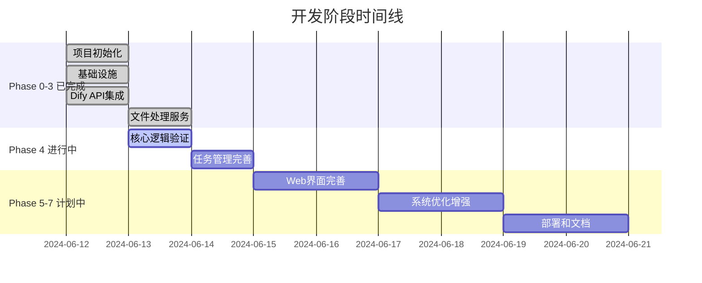

# 开发阶段和里程碑

## 开发阶段概览

项目采用敏捷开发模式，分为多个阶段逐步实现功能。每个阶段都有明确的目标和验收标准。

## Phase 0: 项目初始化 ✅ **已完成**

### 目标
建立项目基础架构和开发环境

### 主要任务
- [x] 创建项目目录结构
- [x] 配置开发环境和依赖
- [x] 设置基础配置管理
- [x] 初始化Git仓库和文档

### 验收标准
- ✅ 项目结构清晰，符合最佳实践
- ✅ 开发环境可正常运行
- ✅ 基础配置系统工作正常

**完成时间**: 2024年6月12日

---

## Phase 1: 核心基础设施 ✅ **已完成**

### 目标
实现系统的核心基础设施和框架

### 主要任务
- [x] 实现配置管理系统 (config.py)
- [x] 设置数据库连接和ORM (database.py)
- [x] 配置结构化日志系统 (logging.py)
- [x] 创建自定义异常处理 (exceptions.py)
- [x] 实现Dify API客户端基础框架
- [x] 创建基础Web应用结构

### 验收标准
- ✅ 配置系统支持环境变量和默认值
- ✅ 数据库连接池正常工作
- ✅ 日志系统输出结构化信息
- ✅ 异常处理机制完善

**完成时间**: 2024年6月12日

---

## Phase 2: Dify API集成 ✅ **已完成**

### 目标
完整集成Dify Workflow API

### 主要任务
- [x] 实现工作流执行API封装
- [x] 实现工作流状态查询API
- [x] 实现工作流日志获取API
- [x] 实现工作流参数获取API
- [x] 实现工作流停止API
- [x] 添加API错误处理和重试机制
- [x] 创建API数据模型

### 验收标准
- ✅ 所有Dify API端点正常调用
- ✅ 错误处理机制完善
- ✅ 数据模型类型安全

**完成时间**: 2024年6月12日

---

## Phase 3: 文件处理服务 ✅ **已完成**

### 目标
实现Excel文件处理和模板生成功能

### 主要任务
- [x] 实现Excel模板生成器
- [x] 实现Excel文件解析器
- [x] 实现文件验证器
- [x] 添加文件上传处理
- [x] 实现结果文件生成

### 验收标准
- ✅ 动态生成Excel模板
- ✅ 正确解析上传文件
- ✅ 文件验证机制完善
- ✅ 结果文件格式正确

**完成时间**: 2024年6月13日

---

## Phase 4: 批量处理引擎 🔄 **进行中**

### Phase 4.1: 核心逻辑验证 🚨 **当前阶段**

#### 目标
验证和完善批量处理的核心逻辑

#### 主要任务
- [ ] 验证批量执行核心功能
- [ ] 测试任务控制功能（暂停/恢复/停止/删除）
- [ ] 完善进度追踪系统
- [ ] 优化错误处理机制

#### 验收标准
- [ ] 端到端批量执行流程正常
- [ ] 任务控制功能完全可用
- [ ] 进度追踪实时更新
- [ ] 错误处理用户友好

**预计完成**: 2024年6月13日

### Phase 4.2: 任务管理完善 📋 **待开始**

#### 目标
完善任务管理和监控功能

#### 主要任务
- [ ] 实现任务日志查看功能
- [ ] 完善任务执行详情展示
- [ ] 实现实时状态更新机制
- [ ] 添加批量操作功能

#### 验收标准
- [ ] 任务日志清晰可读
- [ ] 执行详情信息完整
- [ ] 状态更新及时准确
- [ ] 批量操作高效便捷

**预计完成**: 2024年6月14日

---

## Phase 5: Web界面完善 📋 **待开始**

### 目标
完善用户界面和用户体验

### 主要任务
- [ ] 实现任务监控面板
- [ ] 添加统计图表和实时进度显示
- [ ] 实现高级筛选和搜索功能
- [ ] 优化用户体验和界面响应性

### 验收标准
- [ ] 监控面板信息丰富直观
- [ ] 图表展示清晰美观
- [ ] 搜索功能快速准确
- [ ] 界面操作流畅自然

**预计完成**: 2024年6月16日

---

## Phase 6: 系统优化和增强 📋 **待开始**

### 目标
优化系统性能和增强稳定性

### 主要任务
- [ ] 性能监控和优化
- [ ] 缓存机制优化
- [ ] 数据库查询优化
- [ ] 错误恢复机制完善

### 验收标准
- [ ] 系统性能指标达标
- [ ] 缓存命中率高
- [ ] 数据库查询高效
- [ ] 错误恢复机制可靠

**预计完成**: 2024年6月18日

---

## Phase 7: 部署和文档 📋 **待开始**

### 目标
完善部署方案和项目文档

### 主要任务
- [ ] 容器化部署配置
- [ ] 生产环境配置优化
- [ ] 完善API文档
- [ ] 编写用户手册

### 验收标准
- [ ] 部署流程自动化
- [ ] 生产配置安全可靠
- [ ] 文档完整准确
- [ ] 用户手册易懂实用

**预计完成**: 2024年6月20日

---

## 里程碑时间线

## 风险评估和应对

### 高风险项
1. **Dify API稳定性**: 外部API可能不稳定
   - **应对**: 实现完善的重试和降级机制

2. **并发处理性能**: 高并发场景下的性能问题
   - **应对**: 分阶段压力测试，逐步优化

### 中风险项
1. **文件处理性能**: 大文件处理可能影响性能
   - **应对**: 实现流式处理和分块上传

2. **错误处理复杂性**: 各种异常情况处理复杂
   - **应对**: 建立完善的错误分类和处理机制

### 低风险项
1. **界面兼容性**: 不同浏览器的兼容性问题
   - **应对**: 使用成熟的前端框架和组件

## 质量保证

### 代码质量
- [ ] 代码审查机制
- [ ] 单元测试覆盖率 > 80%
- [ ] 集成测试覆盖核心流程
- [ ] 性能测试验证指标

### 文档质量
- [ ] API文档完整准确
- [ ] 代码注释清晰
- [ ] 用户手册易懂
- [ ] 部署文档详细

---

**文档版本**: v1.0  
**最后更新**: 2024年6月13日  
**当前阶段**: Phase 4.1 