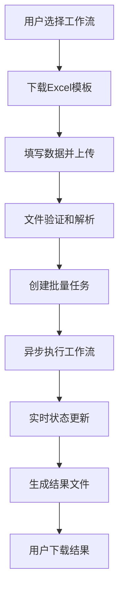

# Phase 5.3: 批量执行界面 - 详细子任务规划

## 任务概述

**目标**: 实现完整的批量执行功能，包括前端UI界面和后端真实执行引擎，让用户能够上传Excel文件并批量执行Dify工作流。

**当前状态**: 
- ✅ 批量处理API已实现（模拟执行）
- ✅ 文件处理服务已完成
- ✅ Dify API客户端已完成
- 📋 需要实现真实的批量执行引擎
- 📋 需要完善前端批量执行界面

## 技术架构设计

### 批量执行流程

### 数据库设计
需要新增以下数据模型：
1. **BatchTask**: 批量任务主表
2. **TaskExecution**: 单个任务执行记录
3. **ExecutionLog**: 执行日志

### 技术组件
1. **前端界面**: 工作流选择、文件上传、进度监控、结果下载
2. **批量处理引擎**: 异步任务执行、状态管理、并发控制
3. **任务监控**: 实时状态更新、进度追踪
4. **结果处理**: 结果收集、文件生成

## 📋 任务完成情况

### ✅ 已完成任务

#### Task 1: 数据库模型设计与实现 ✅
- ✅ 创建了 `app/models/batch_task.py` 包含完整的数据模型
- ✅ 实现了 `BatchTask`、`TaskExecution`、`ExecutionLog` 三个核心模型
- ✅ 定义了完整的状态枚举和字段设计
- ✅ 数据库初始化测试通过

#### Task 2: 批量处理引擎实现 ✅
- ✅ 创建了 `app/services/batch/` 服务包
- ✅ 实现了 `BatchProcessor` 核心批量执行引擎
- ✅ 实现了 `TaskManager` 任务管理服务
- ✅ 实现了 `ProgressTracker` 进度追踪服务
- ✅ 支持异步执行、并发控制、错误处理、重试机制

#### Task 3: API接口完善 ✅
- ✅ 更新了 `app/api/batch.py` 使用真实执行引擎
- ✅ 实现了任务停止、删除、状态查询功能
- ✅ 完善了错误处理和响应格式
- ✅ API测试通过

#### Task 4: 前端界面实现 ✅
- ✅ 重新设计了完整的 `templates/batch.html` 界面
- ✅ 实现了4步骤向导式任务创建流程
- ✅ 实现了工作流选择、文件上传、执行配置功能
- ✅ 实现了任务列表、进度监控、结果下载功能
- ✅ 添加了任务详情查看、停止、删除操作
- ✅ 修复了所有可访问性问题

### 🔄 进行中任务

#### Task 5: 集成测试与优化 🔄
- 📋 需要进行端到端功能测试
- 📋 需要测试文件上传和批量执行流程
- 📋 需要进行性能测试和优化

## 详细任务拆解

### 🗄️ Task 1: 数据库模型设计与实现
**优先级**: 高 | **预计时间**: 2小时

#### 1.1 创建批量任务数据模型
- [ ] 创建 `app/models/batch_task.py`
- [ ] 实现 `BatchTask` 模型（任务基本信息、状态、统计）
- [ ] 实现 `TaskExecution` 模型（单个执行记录）
- [ ] 实现 `ExecutionLog` 模型（执行日志）

#### 1.2 数据库迁移
- [ ] 更新 `app/models/__init__.py` 导入新模型
- [ ] 创建数据库表结构
- [ ] 测试数据模型CRUD操作

### 🔧 Task 2: 批量处理引擎实现
**优先级**: 高 | **预计时间**: 4小时

#### 2.1 创建批量处理服务
- [ ] 创建 `app/services/batch/` 目录
- [ ] 实现 `batch_processor.py` - 核心批量处理逻辑
- [ ] 实现 `task_manager.py` - 任务状态管理
- [ ] 实现 `progress_tracker.py` - 进度追踪

#### 2.2 异步任务执行
- [ ] 实现工作流并发执行控制
- [ ] 添加错误处理和重试机制
- [ ] 实现执行结果收集和存储
- [ ] 添加任务暂停/恢复/取消功能

#### 2.3 状态管理系统
- [ ] 实现任务状态枚举和转换
- [ ] 添加实时状态更新机制
- [ ] 实现进度计算和统计

### 🌐 Task 3: API接口完善
**优先级**: 中 | **预计时间**: 2小时

#### 3.1 更新批量处理API
- [ ] 修改 `app/api/batch.py` 使用真实执行引擎
- [ ] 实现任务启动、暂停、恢复、取消接口
- [ ] 添加详细的任务状态查询接口
- [ ] 实现任务日志查询接口

#### 3.2 WebSocket支持（可选）
- [ ] 添加WebSocket支持实时状态推送
- [ ] 实现进度实时更新

### 🎨 Task 4: 前端界面实现
**优先级**: 高 | **预计时间**: 6小时

#### 4.1 批量执行主界面
- [ ] 重新设计 `templates/batch.html`
- [ ] 实现工作流选择器组件
- [ ] 添加模板下载功能
- [ ] 实现文件上传组件

#### 4.2 执行配置面板
- [ ] 添加批量执行配置选项
- [ ] 实现并发数控制
- [ ] 添加执行模式选择（立即执行/定时执行）

#### 4.3 进度监控界面
- [ ] 实现实时进度显示
- [ ] 添加任务状态可视化
- [ ] 实现任务操作按钮（暂停/恢复/取消）
- [ ] 添加执行日志查看

#### 4.4 结果展示
- [ ] 实现结果预览功能
- [ ] 添加结果文件下载
- [ ] 实现执行统计展示

### 🧪 Task 5: 集成测试与优化
**优先级**: 中 | **预计时间**: 3小时

#### 5.1 功能测试
- [ ] 端到端批量执行测试
- [ ] 错误场景测试
- [ ] 性能压力测试

#### 5.2 用户体验优化
- [ ] 添加操作确认对话框
- [ ] 优化加载状态和错误提示
- [ ] 实现键盘快捷键支持

## 实现计划

### Phase 1: 核心基础设施 (Task 1-2)
**时间**: 第1-2天
- 完成数据库模型设计
- 实现批量处理引擎核心功能
- 确保基础架构稳定可靠

### Phase 2: API和前端界面 (Task 3-4)
**时间**: 第3-4天  
- 完善API接口
- 实现完整的前端界面
- 集成前后端功能

### Phase 3: 测试和优化 (Task 5)
**时间**: 第5天
- 全面功能测试
- 性能优化
- 用户体验完善

## 技术要点

### 1. 异步处理架构
- 使用 `asyncio` 实现高并发执行
- 合理控制并发数，避免API限流
- 实现优雅的错误处理和重试机制

### 2. 状态管理
- 任务状态：pending, running, paused, completed, failed, cancelled
- 实时状态更新和持久化存储
- 支持任务恢复和断点续传

### 3. 用户体验
- 实时进度反馈
- 直观的状态可视化
- 友好的错误提示和操作指导

### 4. 性能优化
- 合理的并发控制
- 内存使用优化
- 大文件处理优化

## 验收标准

### 功能验收
- [ ] 用户能够选择工作流并下载模板
- [ ] 用户能够上传Excel文件并启动批量执行
- [ ] 系统能够实时显示执行进度和状态
- [ ] 用户能够暂停、恢复、取消批量任务
- [ ] 执行完成后用户能够下载结果文件
- [ ] 系统能够处理各种错误场景

### 性能验收
- [ ] 支持100行数据的批量执行
- [ ] 并发执行不超过API限制
- [ ] 内存使用合理，无内存泄漏
- [ ] 响应时间在可接受范围内

### 用户体验验收
- [ ] 界面直观易用，操作流程清晰
- [ ] 实时反馈及时准确
- [ ] 错误提示友好明确
- [ ] 支持常见的用户操作场景

## 风险评估

### 技术风险
- **API限流**: Dify API可能有调用频率限制
- **并发控制**: 高并发可能导致系统不稳定
- **内存使用**: 大文件处理可能消耗过多内存

### 缓解措施
- 实现智能的并发控制和限流机制
- 添加内存监控和优化
- 完善错误处理和恢复机制

---

**创建时间**: 2024年6月13日  
**预计完成时间**: 2024年6月18日  
**负责人**: AI编程助手  
**状态**: ✅ 基本完成 (Task 1-4已完成，Task 5进行中) 