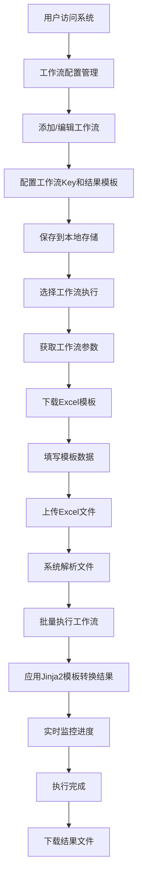

# 项目概述和需求分析

## 项目概述

基于FastAPI框架构建的Dify Workflow批量执行系统，专门用于对接Dify Workflow API，提供批量任务处理能力。支持工作流配置管理、结果模板转换和本地化部署。

## 需求分析与目标拆解

### 核心需求
1. **Dify API集成**：封装Dify Workflow相关API（执行、状态查询、日志获取、参数获取、停止响应）
2. **工作流配置管理**：Web界面维护工作流配置，浏览器本地持久化存储
3. **Excel模板生成**：基于API获取的参数动态生成Excel模板
4. **批量文件处理**：支持用户上传Excel文件进行批量处理
5. **结果模板转换**：使用Jinja2模板将工作流结果转换为表格输出格式
6. **并发执行管理**：支持高并发工作流执行和状态监控
7. **结果数据导出**：执行完成后提供Excel格式的结果下载
8. **本地化部署**：所有外部依赖本地化，避免网络超时问题

### 技术目标
- 高性能异步处理
- 用户友好的Web界面
- 完整的错误处理和日志记录
- 可扩展的架构设计
- 离线可用的前端资源

## 业务流程图

## 用户角色和使用场景

### 主要用户角色
1. **业务用户**：需要批量处理数据的业务人员
2. **系统管理员**：负责工作流配置和系统维护
3. **开发人员**：系统集成和定制开发

### 核心使用场景
1. **批量数据处理**：上传包含多行数据的Excel文件，批量调用Dify工作流
2. **结果数据收集**：收集所有执行结果，生成统一的结果报告
3. **任务监控管理**：实时监控任务执行状态，支持暂停、恢复、停止操作
4. **错误处理恢复**：处理执行失败的任务，支持重试和错误分析

## 系统边界和约束

### 系统边界
- **输入**：Excel文件、工作流配置、执行参数
- **输出**：执行结果Excel文件、任务状态报告、错误日志
- **集成**：Dify Workflow API、本地文件系统、SQLite数据库

### 技术约束
- **部署环境**：macOS (Apple Silicon)
- **Python版本**：3.x
- **数据库**：SQLite（本地开发）/ PostgreSQL（生产环境）
- **并发限制**：可配置的最大并发数
- **文件大小**：Excel文件大小限制

### 业务约束
- **数据安全**：本地化部署，数据不出本地环境
- **性能要求**：支持100+行数据的批量处理
- **可用性**：7x24小时本地服务可用
- **扩展性**：支持多种工作流类型和参数格式

## 成功标准

### 功能完整性
- [ ] 用户可以完整地从添加工作流到下载结果
- [ ] 系统支持所有核心的任务管理操作
- [ ] 错误处理机制完善，用户体验良好

### 性能指标
- [ ] 单个任务执行时间 < 30秒
- [ ] 批量任务启动响应时间 < 5秒
- [ ] 支持最大并发数 >= 10

### 稳定性要求
- [ ] 连续运行24小时无异常
- [ ] 处理100+行数据无内存泄漏
- [ ] 网络异常情况下的优雅降级

---

**文档版本**: v1.0  
**最后更新**: 2024年6月13日  
**状态**: 需求分析完成 